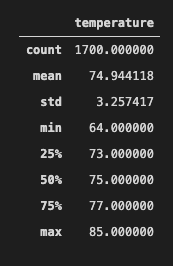
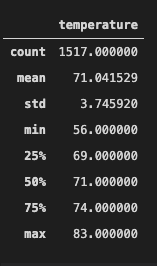

# Surfs Up

## Project Overview

This project seeks to examine weather patterns in Hawaii in order to determine the best place to open a surf board and ice cream shop. Specifically, creating a statistical analysis of temperatures in the summer and winter will help inform whether this business can survive year round. The main tools used for creating this analysis were sqlalchemy's querying and filtering tools and python's pandas module to analyze the data.

## Results

Three key findings from the temperature analysis for December and June are listed below:

1. The standard deviation for temperatures in December and June are just above 3 which is relatively low (Figures 1 and 2). This means the weather does not vary too much, and should be very temperate season to season. This is beneficial to a store that sells surf gear and ice cream because the impact of seasonal weather will be minimal.
2. The average weather for December and June are relatively warm, which should be beneficial to selling ice cream and surf gear (Figures 1 and 2).
3. The minimum temperature reaches just above 50 degrees fahrenheit in December, which could decrease ice cream sales during the colder days in the winter (Figure 2). However, because the temperatures increase with the percentiles, the cold weather should only affect ice cream sales for a few days in December (Figure 2).

Figure 1 shows the statistical breakdown of temperatures in June, and Figure 2 shows the staistical breakdown of temperatures in December. 

### Figure 1

### Figure 2

## Summary

Overall, this data suggests that the weather in this location should work well for a surf gear and ice cream shop. Because the weather for this location experiences minimal variations in temperature, abnormally cold weather should not effect sales and customer traffic at this location. An additional analysis that would be beneficial to this business plan is to create a linear regression of weather patterns over time to see if the weather will become increasingly inclement due to global warming and other environmental factors. This could help project the feasability of this business over a long period of time. Another analysis that would be helpful is to find datasets about weather, ice cream and surf gear sales and locations to confirm the hypothesis that weather effects the sales of these products. This would be a more complicated analysis, but could prove extremely useful in determining what weather is best for the sale of these products.
